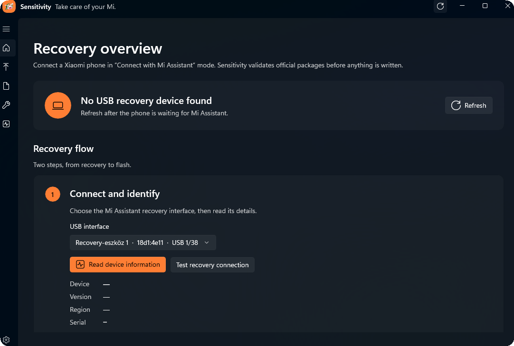
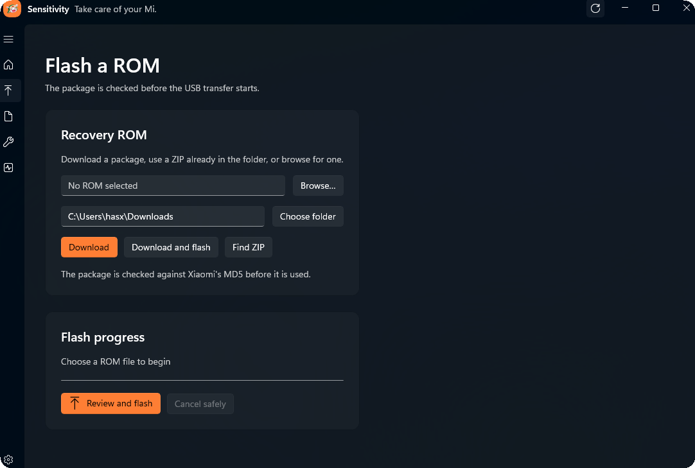
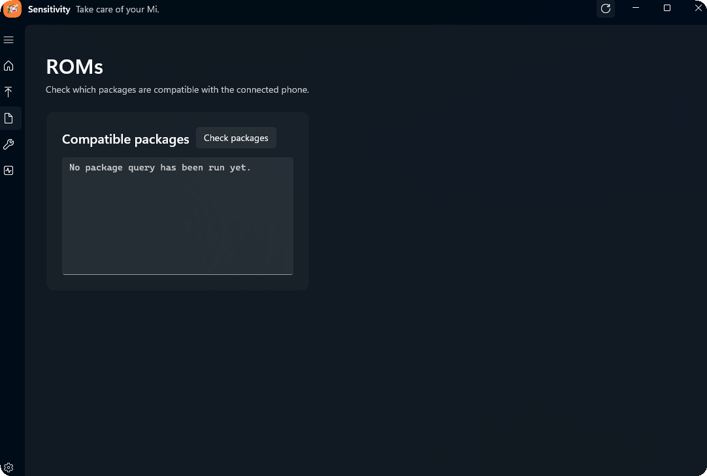
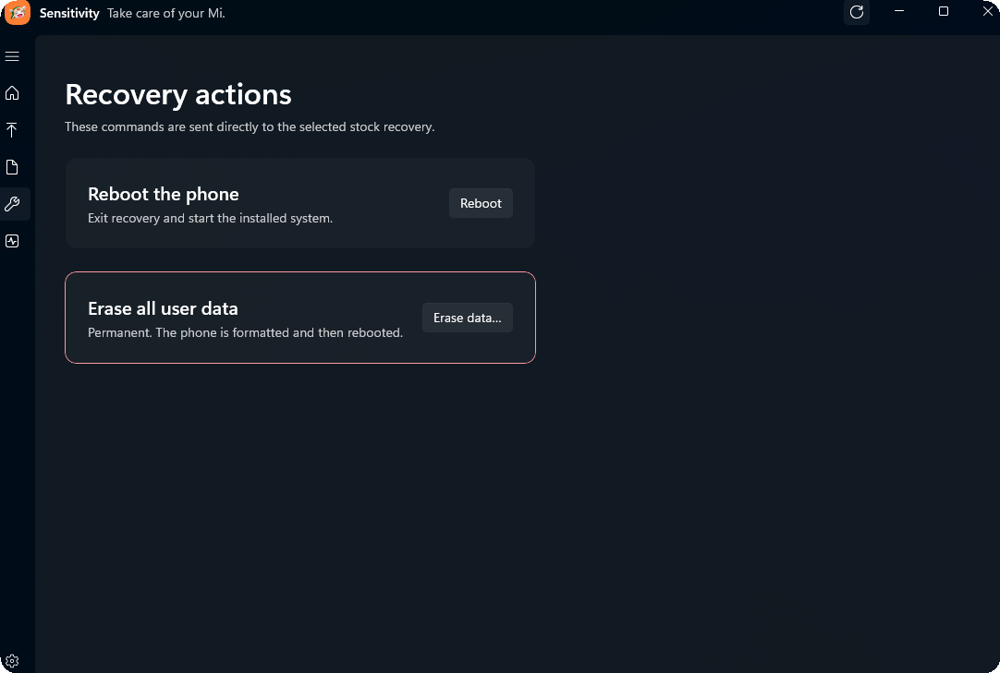
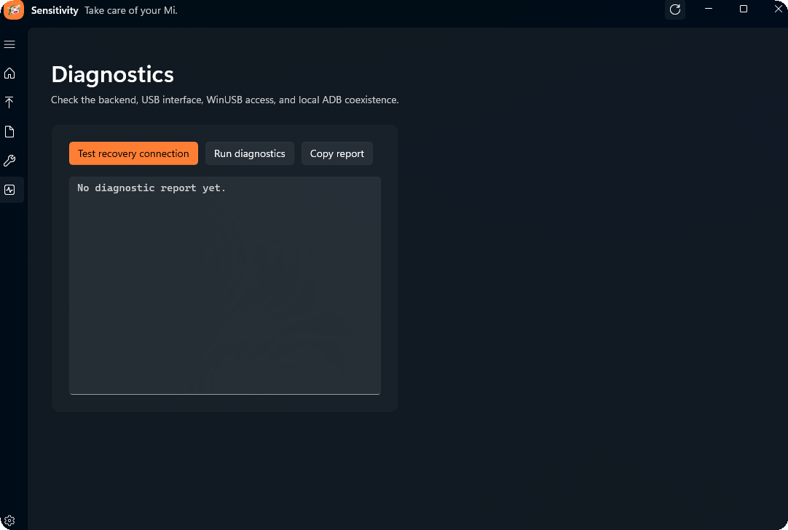
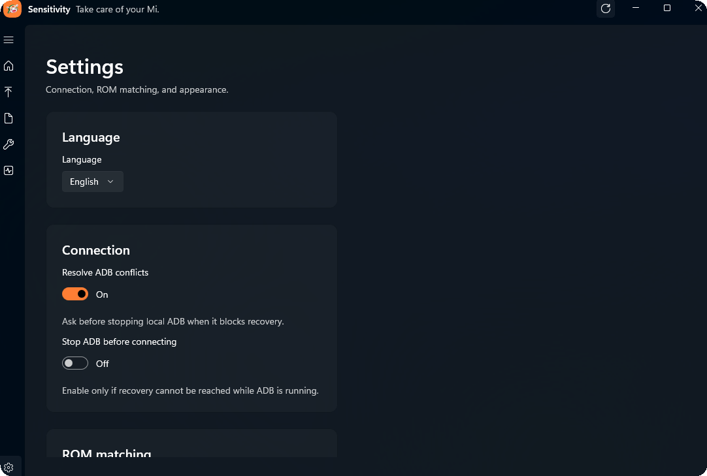

<p align="center">
  
</p>

<h1 align="center"> Sensitivity — Take care of your Mi.</h1>

<p align="center">
  
  
  
  <a href="https://discord.gg/v4TkjmBHbG"></a>
  
  
</p>

Sensitivity is a direct-USB Xiaomi Recovery flash and rescue tool. It is the maintained successor to MiAssistantFork (MAF), with one shared protocol core, a safe CLI, a native Windows application, and a lightweight portable GUI on Linux and macOS.

The Windows application is built with WinUI 3 and the Windows App SDK. Its Fluent 2 interface follows Fluent Design conventions: adaptive navigation, native system theme and accent resources, Mica where Windows supports it, accessible controls, and Segoe Fluent icons. It is a real desktop application, not a web wrapper.

Developed and published by [Chromatic](https://chromatic.hu). For product feedback, contact [feedback@chromatic.hu](mailto:feedback@chromatic.hu). For installation help, recovery questions, and community support, join the [Chromatic Discord server](https://discord.gg/v4TkjmBHbG).

It speaks the Mi Assistant ADB-like protocol directly over USB, validates official Recovery ROMs with Xiaomi's `miotaV3` service, and streams approved packages to stock recovery. It does not require `adb`, an unlocked bootloader, or proprietary Xiaomi desktop software.

> [!CAUTION]
> Flashing can erase data or leave a device unable to boot. Use an official Recovery ROM for the exact device and region. Sensitivity does not bypass bootloader, account, anti-rollback, or FRP protections.

## Install

Download a release for Windows, Linux, or macOS from [GitHub Releases](https://github.com/Has-X/Sensitivity/releases). On Windows, choose the native `Sensitivity-Setup-x64.exe` or `Sensitivity-Setup-arm64.exe` for the processor architecture, then open Sensitivity from Start. Portable ZIPs are available too. The Windows app follows the system light or dark mode and accent colour, with Mica material where supported. The app and CLI support 34 languages; see the [localization guide](docs/LOCALIZATION.md) for the maintained list and translation rules. The separate `sensitivity-cli.exe` is for terminals and scripts. On Linux or macOS, open `sensitivity-gui`. Releases include SHA-256 checksums.

To build or install from source:

```console
cargo install --git https://github.com/Has-X/Sensitivity --locked
# or, from a clone
cargo build --workspace --release --locked
```

Linux release archives include an optional desktop-access rule. Install it once with `./install-udev-rule.sh`, reconnect the phone, and use `./install-udev-rule.sh --uninstall` to remove it. Windows archives include a focused WinUSB setup guide for the Mi Assistant interface (class `ff`, subclass `42`, protocol `01`).

## Quick start

In the desktop app, select the detected recovery and ROM, review validation and wipe warnings, then flash. The native Windows interface and portable Unix interface both delegate recovery work to the same Rust implementation.

For the CLI:

1. Boot the phone into stock recovery and choose **Connect with Mi Assistant**.
2. Connect it directly by USB and run the setup check. On Windows, use the packaged CLI executable:

   ```powershell
   .\sensitivity-cli.exe doctor
   ```

   On Linux and macOS, use:

   ```console
   sensitivity doctor
   ```

3. Read the detected device identity with the same platform-specific command:

   ```powershell
   .\sensitivity-cli.exe info
   ```

   ```console
   sensitivity info
   ```

4. Flash an official Recovery ROM:

   ```powershell
   .\sensitivity-cli.exe flash C:\path\to\recovery-rom.zip
   ```

   ```console
   sensitivity flash /path/to/recovery-rom.zip
   ```

Sensitivity calculates the package MD5, asks Xiaomi's service for approval and the validation token, warns when the response requires a data wipe, and then starts sideloading. Review the displayed device and wipe information before continuing.

## Showcase

<p align="center">
  
</p>

The native GUI is the recommended starting point for most users. It guides the recovery flow from device detection through ROM selection, validation, flashing, diagnostics, and settings without requiring terminal commands. The overview keeps the safe next action visible and shows device identity before any package operation.

<table>
  <tr>
    <td></td>
    <td></td>
  </tr>
  <tr>
    <td></td>
    <td></td>
  </tr>
  <tr>
    <td></td>
    <td></td>
  </tr>
</table>

The maintained documentation is available in the [Sensitivity Wiki](https://github.com/Has-X/Sensitivity/wiki); its source pages remain in [`docs/wiki`](docs/wiki/Home.md). For setup questions and community support, use the [Chromatic Discord server](https://discord.gg/v4TkjmBHbG). Security reports belong in the [Security Advisory flow](https://github.com/Has-X/Sensitivity/security/advisories/new), not in public issues.

Translation contributors should use the [English source and translator guide](docs/LOCALIZATION.md). It records the safety context for Windows, installer, portable GUI, and CLI messages.

Use `sensitivity help` or `sensitivity help <command>` for the complete command reference. On Windows, use `sensitivity-cli.exe help` or `sensitivity-cli.exe help <command>`.

On Windows, the packaged command is `sensitivity-cli.exe` (or `sensitivity-cli` after the installer adds it to `PATH`). On Linux and macOS, the command is `sensitivity`. The examples below use the cross-platform name.

## Common commands

```console
sensitivity doctor                       # diagnose USB and local ADB coexistence
sensitivity devices                      # list matching USB interfaces without claiming them
sensitivity detect                       # verify the direct-USB protocol handshake
sensitivity info                         # human-readable device information
sensitivity info --json                  # stable output for scripts
sensitivity completions bash             # generate shell completion definitions
sensitivity list-allowed-roms             # query packages accepted for this device
sensitivity download-latest               # download and verify the latest approved ROM
sensitivity flash ROM.zip                 # validate and flash a local package
sensitivity flash-from-latest             # download, validate, and flash
sensitivity reboot                        # leave recovery
```

Cross-region validation is advanced and can wipe data:

```console
sensitivity --profile global --codename garnet flash ROM.zip
```

The supported profiles are `global`, `eea`, `in`, `ru`, `id`, `tr`, `tw`, and `cn`.

## ADB coexistence

Sensitivity uses direct USB and leaves a local Android Debug Bridge server untouched by default. If `adb` already owns the recovery interface, stop it only for this invocation:

```console
sensitivity --adb-policy stop doctor
sensitivity --adb-policy stop flash ROM.zip
```

Sensitivity never occupies port 5037 and only asks the ADB server to stop when you choose that policy. The Windows app detects likely ownership conflicts, explains the impact, and asks before retrying.

Users and scripts moving from the older project should read [Migrating from MiAssistantFork](docs/MIGRATING_FROM_MAF.md).

## Safety behavior

- HTTPS validation is required unless the advanced `--http` override is supplied.
- Package integrity is checked before downloaded ROMs are used.
- Server-requested wipes are shown before flashing; `--yes` is intended for automation.
- A manual token does not imply permission to wipe; add `--wipe` explicitly when required.
- Validation tokens are never printed or passed to the Windows presentation layer.
- `doctor` reports setup problems without changing the ADB server unless explicitly requested.
- Ctrl-C during sideload requests a graceful close after the current USB operation.

Hardware behavior varies between recovery versions. Offline CI proves builds, parsing, crypto framing, and command behavior; it cannot prove a real flash. Please report the device codename, OS, recovery version, command output, and ROM filename when filing a hardware issue.

## Development

Requirements: Rust 1.97.1 or newer. `libusb` is built from vendored sources.

```console
cargo fmt --all -- --check
cargo test --workspace --locked
cargo clippy --workspace --all-targets --locked -- -D warnings
cargo build --workspace --release --locked
```

The ADB header parser also has an isolated cargo-fuzz target:

```console
cd fuzz
cargo +nightly fuzz run adb-header
```

Tagging a version such as `v1.1.3` builds self-contained Fluent 2 WinUI 3 applications and architecture-matched x64 and ARM64 Inno Setup installers for Windows, portable Linux and macOS applications, `SHA256SUMS`, and a GitHub Release.

The native process boundary, cancellation handshake, and machine-event schema are documented in [Native Windows architecture](docs/WINDOWS_ARCHITECTURE.md). Contributors should also follow the repository [engineering guide](AGENTS.md) and [design system](DESIGN.md).

## Project lineage

Sensitivity fully consolidates the useful parts of [MiAssistantFork](https://github.com/Has-X/MiAssistantFork). The separate MAF implementation is retired: both front ends use Sensitivity's single tested core, while unsafe or redundant MAF behavior is intentionally absent. See the [consolidation ledger](docs/MAF_CONSOLIDATION.md).

## License

Copyright (C) 2026 Chromatic and contributors. Sensitivity is licensed under the [GNU Affero General Public License v3.0](LICENSE), SPDX identifier `AGPL-3.0-only`.

Commercial use is not categorically prohibited by the AGPL. Distribution or network use of a modified version must satisfy the license's corresponding-source and licensing requirements. No Xiaomi proprietary components are included.
