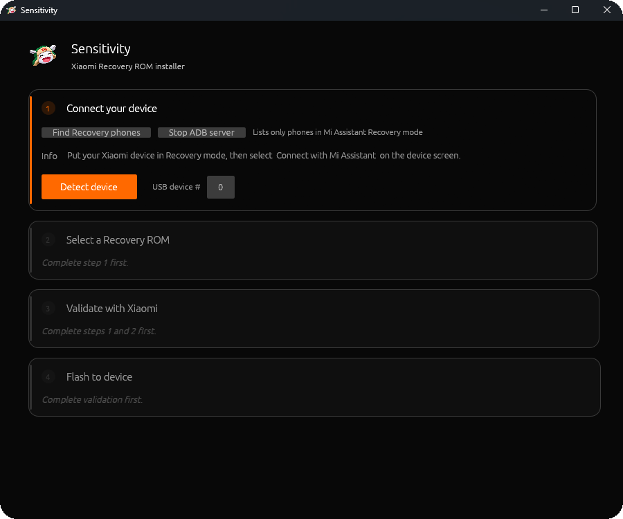

<p align="center">
  
</p>

<h1 align="center"> Sensitivity</h1>

<p align="center">
  Cross-platform Xiaomi Recovery ROM tooling for Windows and Linux.<br>
  Read the recovery identity, resolve the official ROM, validate it, and sideload it with clear safety gates.
</p>

<p align="center">
  
  
  
  <a href="https://www.rust-lang.org/"></a>
  <a href="https://github.com/emilk/egui"></a>
  <a href="https://www.gnu.org/licenses/agpl-3.0.html"></a>
  
</p>

Sensitivity talks to the Mi Assistant recovery interface directly over USB. It does not need `adb.exe` for the actual recovery protocol, and it never tries to bypass bootloader locks, anti-rollback, FRP, or stock recovery safeguards.

> The artwork is a project asset for the README hero. Xiaomi and Mi branding remain the property of their respective owners.

## Why Sensitivity

- Clean native GUI for Windows and Linux, built with egui.
- Reads the connected stock-recovery device identity over USB.
- Downloads the latest ROM Xiaomi returns for that device and selected profile.
- Verifies downloaded ROMs against Xiaomi's published MD5 before they become selectable for flashing.
- Validates every selected ROM with Xiaomi before sideloading.
- Shows live download and sideload progress, clear errors, and an explicit data-wipe acknowledgement.
- Keeps the full CLI for diagnostics and advanced recovery work.

The same guarded workflow is available in the native egui GUI and in the CLI. You can test the interface without a phone by starting the GUI with `--demo` or running `sensitivity demo`.

The GUI only uses Xiaomi's `miotaV3` response, requires HTTPS ROM mirrors, and validates the reported MD5. Known Xiaomi CDN routes are tried in order when a returned mirror is unavailable.

## Showcase

<p align="center">
  
</p>

The screenshot shows the guarded first step. Sensitivity lists Mi Assistant Recovery interfaces, lets you release a conflicting ADB server, reads the device identity, and keeps later ROM actions locked until the earlier checks are complete.

## Current status

- Windows and Linux release binaries are built from the same Rust codebase.
- The GUI and CLI have offline demo coverage and a live Xiaomi metadata probe.
- Real Recovery devices remain required for the final USB sideload step.
- A ROM is never presented as ready to flash until its checksum and Xiaomi validation both pass.

## GUI flow

1. Boot the phone into stock recovery and choose **Connect with Mi Assistant**.
2. Connect it by USB, select **Find Recovery phones**, then choose the detected interface.
3. Select **Detect device** to read the phone's model and recovery identity.
4. Either drag a local Recovery ROM `.zip` into Sensitivity or select **Get latest official ROM**.
5. Choose a region profile only when it matches the intended official ROM.
6. Select **Validate ROM**. The flash button stays disabled until that exact ROM and profile have passed validation.
7. If Xiaomi requires a wipe, explicitly acknowledge it before flashing.

The default GUI download folder is a Sensitivity-managed local data folder. It is created only when a download starts.

Start the GUI with `sensitivity-gui --demo` to expose **Try demo mode** in the top-right. Demo mode never opens USB, downloads a ROM, sends a validation request, or flashes a device. The regular GUI does not expose demo controls.

The GUI follows the system colour theme by default. Override it at startup with `sensitivity-gui --theme light` or `sensitivity-gui --theme dark`. There is no in-app theme switch.

## Install on Windows

Windows release artifacts include:

- `sensitivity-gui-windows-x86_64.exe`
- `sensitivity-windows-x86_64.exe`
- `install-sensitivity.ps1`

Extract the artifact into an empty folder and run:

```powershell
Set-ExecutionPolicy -Scope Process Bypass
.\install-sensitivity.ps1
```

The installer copies both executables to `%LOCALAPPDATA%\Sensitivity\bin`, creates `%LOCALAPPDATA%\Sensitivity\roms`, adds the bin folder to the current user's `PATH`, and creates a Start Menu shortcut for the GUI. It does not require administrator rights or modify the system-wide `PATH`.

Start the GUI from the shortcut, or from a new terminal:

```powershell
sensitivity-gui
```

For the Mi Assistant USB interface on Windows, install a WinUSB driver with Zadig for interface class `0xff`, subclass `0x42`, protocol `1`.

## Linux

Download the Linux artifact, make both files executable, and start the GUI:

```bash
chmod +x sensitivity-linux-x86_64 sensitivity-gui-linux-x86_64
./sensitivity-gui-linux-x86_64
```

The GUI is built with the OpenGL/Glow eframe backend, avoiding a GPU-specific WGPU dependency path. A current graphics stack with X11 or Wayland support is required to run it.

## Build from source

Prerequisite: Rust stable **1.97+**.

```bash
# CLI
cargo build --release --locked

# GUI
cargo build --release --locked --features gui --bin sensitivity-gui
```

Outputs:

- Windows: `target\release\sensitivity.exe` and `target\release\sensitivity-gui.exe`
- Linux: `target/release/sensitivity` and `target/release/sensitivity-gui`

GitHub Actions builds both binaries for Windows and Linux and packages the Windows installer script with the Windows artifact.

## CLI quick reference

```text
# Read the stock-recovery device identity
sensitivity read-info

# List USB interfaces currently in Mi Assistant Recovery mode
sensitivity devices

# Exercise the safe offline CLI demonstration
sensitivity demo

# Download the current official ROM Xiaomi reports for the device
sensitivity download-latest --profile global --codename garnet

# Validate and flash a local Recovery ROM
sensitivity flash "/path/to/rom.zip" --profile global --codename garnet --yes

# Download, validate, then flash in one guarded CLI flow
sensitivity flash-from-latest --profile global --codename garnet --yes
```

Supported region profiles: `global`, `eea`, `in`, `ru`, `id`, `tr`, `tw`, and `cn`. The profile changes the identity sent for validation. It is not a bypass mechanism.

## Safety and troubleshooting

- A locked device can reject downgrades. Sensitivity does not attempt to defeat that protection.
- Cross-region updates can require a data wipe. Only enable wipe after confirming that data loss is acceptable.
- A validation token is sensitive. Redact `--dump-json` output before sharing it.
- If no device is detected, confirm that the phone is in **Connect with Mi Assistant**, not ordinary ADB sideload mode, then verify the Windows WinUSB driver or Linux USB permissions.
- No physical device is needed to build, test, or launch the GUI. Use GUI **Try demo mode** or `sensitivity demo` to test the complete interface flow safely. Flashing itself must be tested with a real recovery-mode device.

## Development verification

```bash
cargo fmt --all -- --check
cargo clippy --all-targets --all-features -- -D warnings
cargo test --all-targets --all-features
cargo build --release --locked --bins --features gui
```

To test Xiaomi's live URL resolution without downloading the complete ROM, export your own Recovery identity only into the current shell, then run the ignored live test. It asks Xiaomi for the ROM metadata, validates the returned HTTPS URL and MD5 syntax, and reads only 4 KiB from the URL. It does not print the serial number, token, or raw response.

```powershell
$env:SENSITIVITY_LIVE_DEVICE = "..."
$env:SENSITIVITY_LIVE_SN = "..."
$env:SENSITIVITY_LIVE_VERSION = "..."
$env:SENSITIVITY_LIVE_CODEBASE = "..."
$env:SENSITIVITY_LIVE_BRANCH = "..."
$env:SENSITIVITY_LIVE_LANGUAGE = "..."
$env:SENSITIVITY_LIVE_REGION = "..."
$env:SENSITIVITY_LIVE_ROMZONE = "..."
cargo test --test live_xiaomi -- --ignored
```

## License

See [LICENSE](LICENSE). Sensitivity contains no Xiaomi proprietary components.
